# Queue System App

This repository contains the APK for the Queue System mobile application developed for Macber Egy company.

## Overview

The Queue System app provides a streamlined experience for users to manage bookings and view their booking history. It includes features such as authentication, venue selection, ticket booking, reporting history, user profile management, and robust error handling.

### Features

1. **Authentication:**
   - Users can register using their details, including company or individual status.
   - OTP verification for account creation (work in progress).
   - Password creation and login using email and password.
   - Forgot password functionality with OTP method for resetting.

2. **Venue Selection and Booking:**
   - Multiple sliders display venues, workspaces, and rooms available for booking.
   - Users can create tickets by selecting their preferred options.
   - Notification via snackbar on successful or unsuccessful bookings.

3. **Report History:**
   - Pagination for displaying all user tickets.
   - Filtering options to refine the displayed tickets.
   - Details screen for viewing ticket specifics.

4. **User Profile Management:**
   - Users can update their information securely.
   - Validation applied to ensure data integrity.

### Technologies Used

- **State Management:** [Provider](https://pub.dev/packages/provider)
- **Caching:** [Shared Preferences](https://pub.dev/packages/shared_preferences)
- **Secure Data Storage:** [Flutter Secure Storage](https://pub.dev/packages/flutter_secure_storage)
- **Loading Animation:** [Shimmer](https://pub.dev/packages/shimmer)
- **Navigation:** [Go Router](https://pub.dev/packages/go_router)
- **API Handling:** [Flutter Retrofit](https://pub.dev/packages/retrofit)
- **Analytics and Future Integration:** [Firebase Core](https://pub.dev/packages/firebase_core)
- **Async Button:** [Async Button](https://pub.dev/packages/async_button)

### Installation

To install the app on your Android device:

1. Download the APK file

2. Enable installation from unknown sources in your device settings.

3. Open the APK file and follow the on-screen instructions to install the app.

### Contact

For any questions or feedback, feel free to reach out:

### App Screenshots

<table>
  <tr>
     
1. Authentication:
    <td>Log In Screen </td>
    <td>Register Screen </td>
    <td>Forget Password Screen </td>
    <td>OTP Screen </td>
    <td>Create Password Screen </td>

  </tr>
  <tr>
    <td>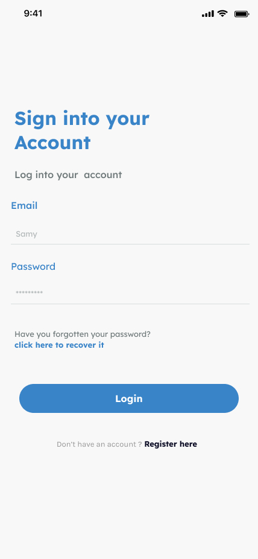</td>
    <td>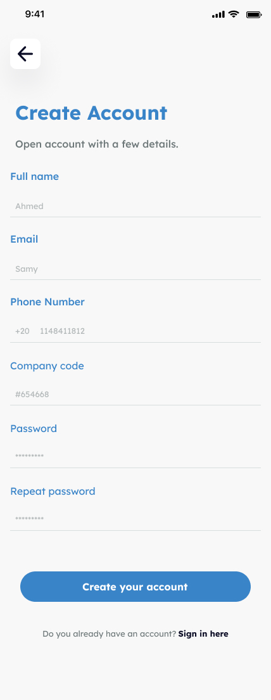</td>
    <td>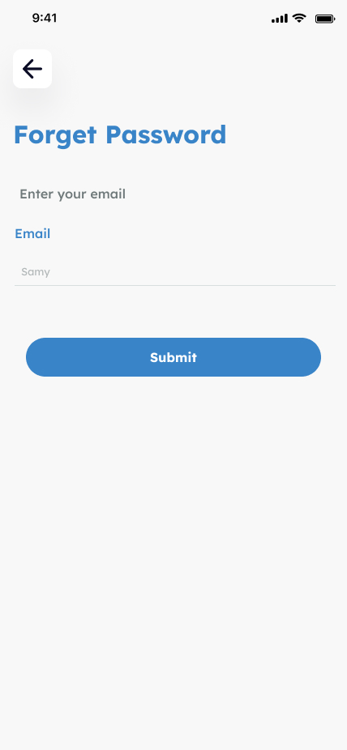</td>
    <td>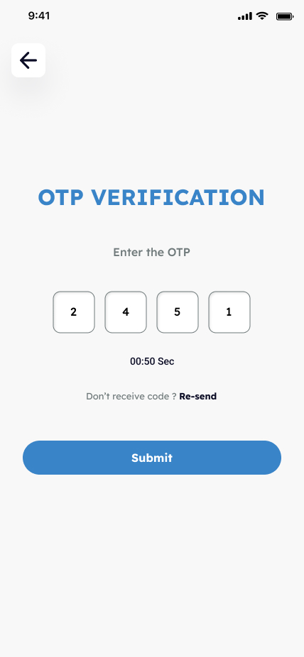</td>
    <td>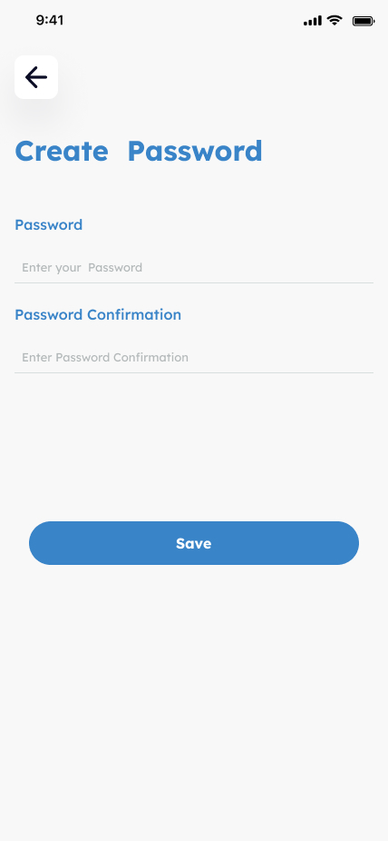</td>

  </tr>
 </table>

 <table>
  <tr>
     
2. Venue Selection and Booking:
    <td>Home Screen </td>
    <td>Ticket Type Screen </td>
    <td>Category Screen </td>
    <td>Add Place Screen </td>

  </tr>
  <tr>
    <td>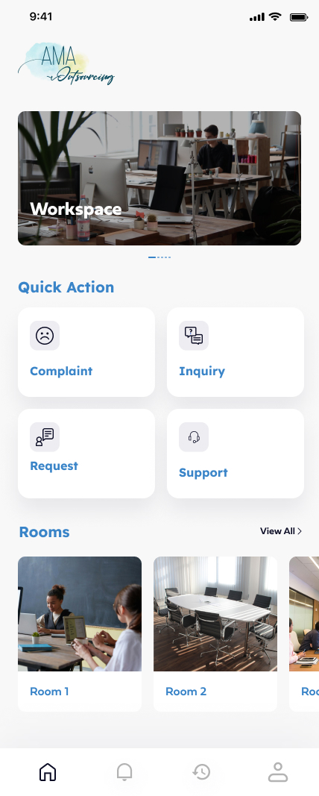</td>
    <td>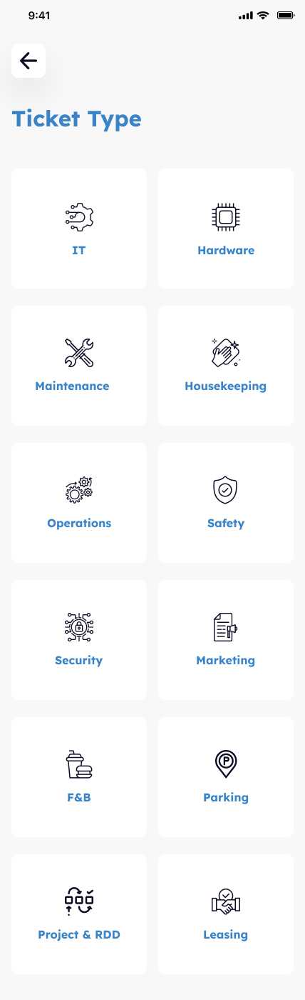</td>
    <td>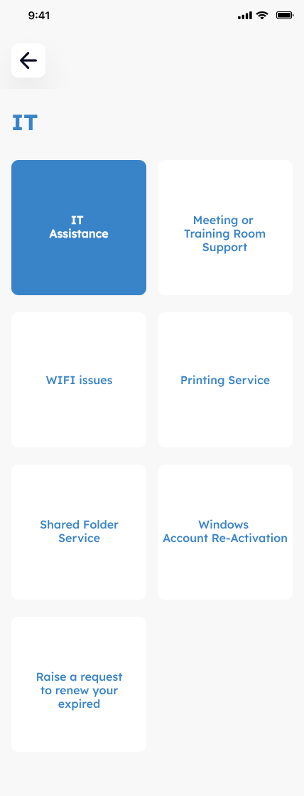</td>
    <td></td>

  </tr>
 </table>

  <table>
  <tr>
     
3. Report History:
    <td>History Reporting Screen </td>
    <td>Filter Bottom Sheet </td>
    <td>Report Details Screen </td>

  </tr>
  <tr>
    <td>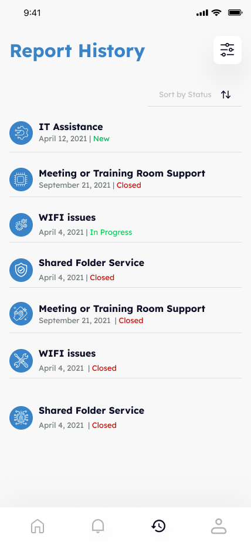</td>
    <td>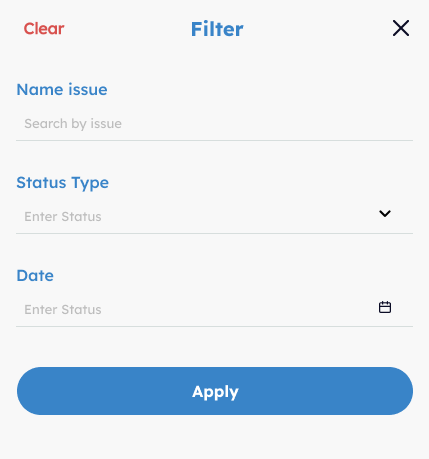</td>
    <td>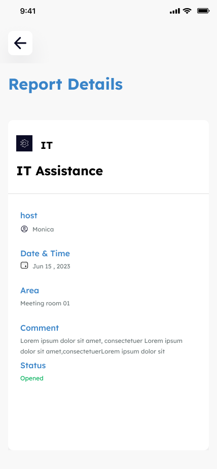</td>

  </tr>
 </table>
 
  <table>
  <tr>

4. User Profile Management:
    <td>Profile Screen </td>
    <td>About Screen </td>
    <td>Personal Details Screen </td>
      <td>Edit Profile Screen </td>
    <td>Change Password Screen </td>

  </tr>
  <tr>
    <td>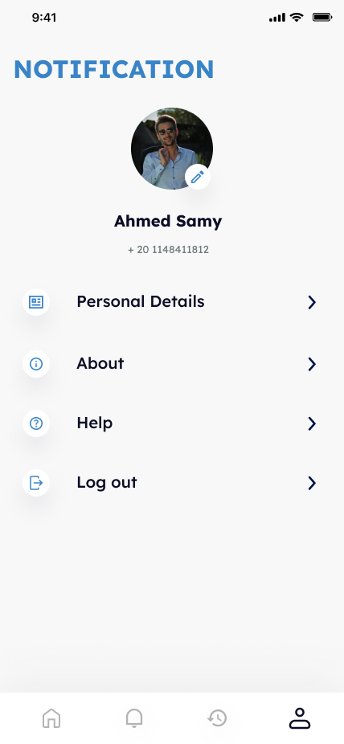</td>
    <td>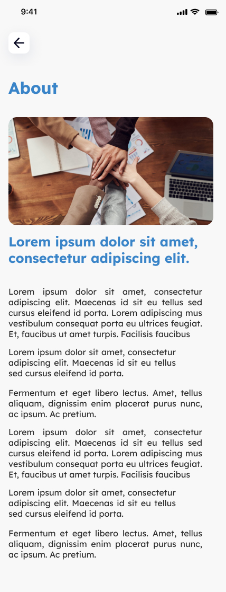</td>
    <td>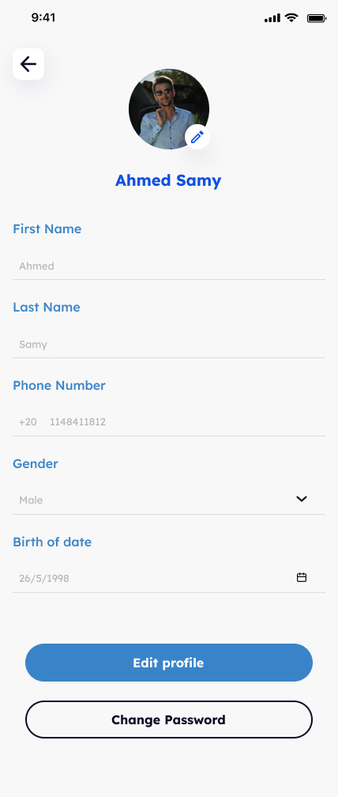</td>
    <td>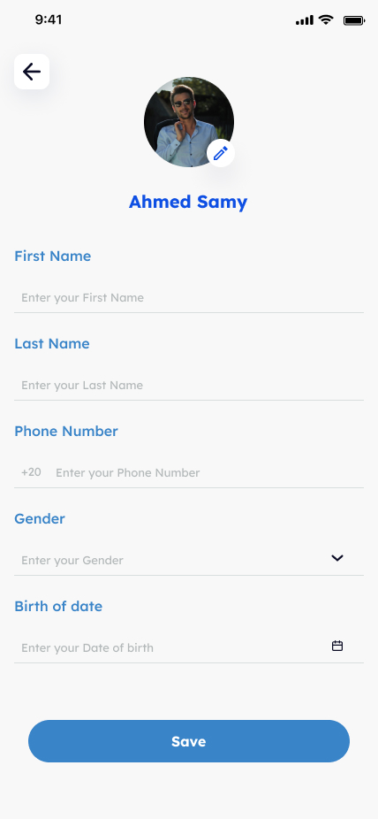</td>
    <td>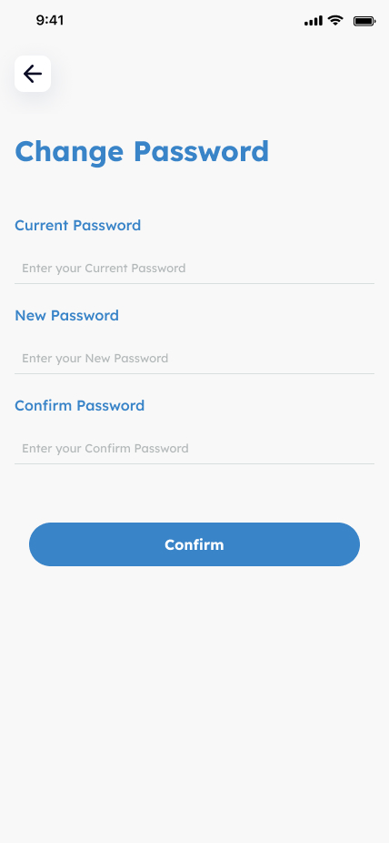</td>

  </tr>
 </table>
 
 </tr>
 </table>

<table>
  <tr>
     
5. Error Handling:
    <td>Error Screen </td>

  </tr>
  <tr>
    <td></td>

  </tr>
 </table>

 <table>
  <tr>
     
---
### Note
This repository does not include the source code to protect the privacy of Macber Egy company. The APK is provided for demonstration purposes only.

